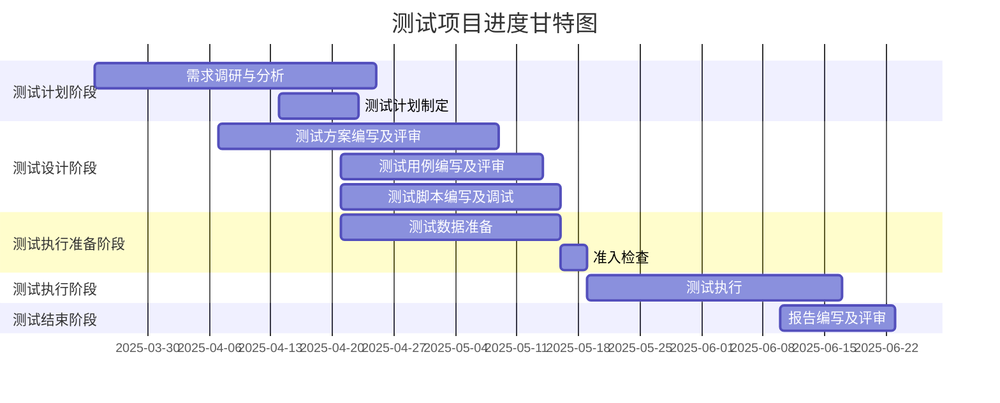

# mermaid


## reference
> - [在线编辑器](https://mermaid-live.nodejs.cn/edit)
> - [官方文档](https://mermaid.nodejs.cn/intro/)


## Appendix 1: 在线编辑器gantt配置
### example 1
```json
{
  "theme": "default",
  "gantt": {
    "titleTopMargin": 25,
    "barHeight": 40,
    "fontSize": 16,
    "sectionFontSize": 16,
    "barGap": 8,
    "topPadding":50,
    "leftPadding":150,
    "tickInterval": "1week"
  }
}
```


### example 2
```json
{
  "theme": "default",
  "themeCSS": ".section{fill:#f0f9ff;stroke:#cce6ff;font-family:'Segoe UI';color:#2c3e50;rx:6px;ry:6px;}.task{fill:#a3d4ff;stroke:#7ab8eb;rx:4px;ry:4px;}.taskText{fill:#2c3e50;font-family:'Segoe UI';font-size:13px;}.grid .tick{stroke:#d4eaff;stroke-width:0.8;}.today{fill:#ffd700;stroke:#e6c200;}.milestone{fill:#4dabf7;stroke:#339af0;shape-rendering:crispEdges;}.crit{stroke:#ff6b6b;stroke-width:2px;}.active{fill:#69db7c;stroke:#40c057;}",
  "gantt": {
    "titleTopMargin": 25,
    "barHeight": 40,
    "fontSize": 16,
    "sectionFontSize": 16,
    "barGap": 8,
    "topPadding": 50,
    "leftPadding": 150,
    "tickInterval": "1week"
  }
}
```


## Appendix 2: 数据探索工具计划表
